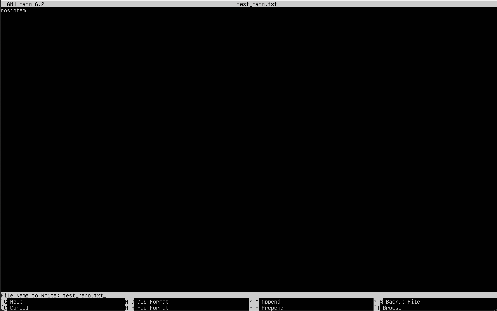
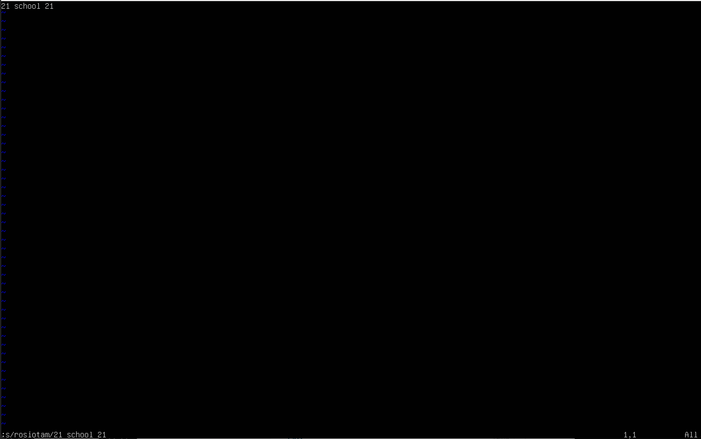
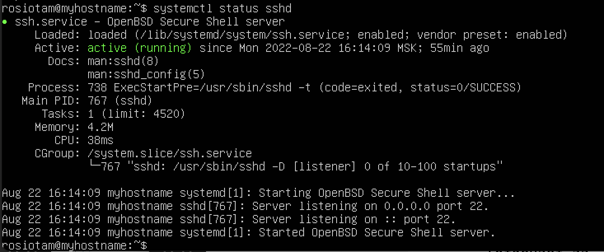
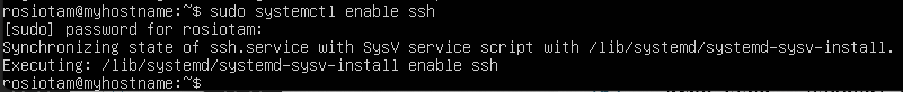

## Part 1. Установка ОС

* Версия ОС Ubuntu 20.04 Server LTS без графического интерфейса:

    

## Part 2. Создание пользователя

* Добавляем нового пользователя:

    

* добавление в группу adm (администраторов):

* вывод команды `cat /etc/passwd`:

## Part 3. Настройка сети ОС

* Установка нового имени машины:

    

*  Установка timezone по месту нахождения:

*  Вывод названия сетевых интерфейсов с помощью консольной команды:

    #### **lo** (loopback device) – виртуальный интерфейс, присутствующий по умолчанию в любом Linux. Он используется для отладки сетевых программ и запуска серверных приложений на локальной машине. 

* Получение ip-адреса устройства от DHCP сервера:

    #### **DHCP** (англ. Dynamic Host Configuration Protocol — протокол динамической настройки узла) — прикладной протокол, позволяющий сетевым устройствам автоматически получать IP-адрес и другие параметры, необходимые для работы в сети TCP/IP. Работает по модели «клиент-сервер».

* gw: 192.168.64.1:

* ip-адрес, полученый от маршрутизатора:

    

* Изменение конфигурации командой: 
    - sudo vim /etc/netplan/00-installer-config.yaml

    

* Проверка изменения адреса:

 * Пинг на удаленные хосты 1.1.1.1 и ya.ru (успешно -  "0% packet loss"):
 

 ## Part 4. Обновление ОС

#### Команды для обновления:

* **apt update** - обновляет индекс пакетов в системе Linux или списки пакетов. Индексный файл пакетов – это файл или база данных, которые содержат список программных пакетов.
* **apt upgrade** - обновляет все устаревшие пакеты, находящиеся в системе, до последних версий
* **apt dist-upgrade** - помимо обновления существующих пакетов программного обеспечения, он устанавливает и удаляет некоторые пакеты для удовлетворения некоторых зависимостей. Команда включает функцию интеллектуального разрешения конфликтов, что гарантирует, что критически важные пакеты обновляются первыми за счет тех, которые считаются имеющими более низкий приоритет.
* **apt autoremove** - удаляет пакеты, которые были установлены автоматически, поскольку они требовались для некоторых других пакетов, но после удаления этих пакетов они больше не нужны.

## Part 5. Использование команды **sudo**

#### **SUDO** - позволяет временно предоставлять привилегии и выполнять задачи администрирования системы, запускать программы от имени других пользователей

* Изменение hostname от имени другого пользователя:

## Part 6. Установка и настройка службы времени

*  Вывод времени:

* Настройка автоматической синхронизации времени:
    + отключить стандартную утилиту:
        * sudo systemctl stop systemd-timesyncd   
        * sudo systemctl disable systemd-timesyncd  

    + установить NTP:  
        * sudo apt-get install ntp  
    + перезагрузить систему:
        * reboot  

    

## Part 7. Установка и использование текстовых редакторов

#### Запись в файл с сохранением:

* **VIM** - выход с сохранением изменений: Esc -> : -> wq!

    
* **NANO** - выход с сохранением изменений: Сontrol+O -> Control+X

* **MCEDIT** - выход с сохранением изменений: Esc -> Yes

#### Редактирование и выход без сохранения:

* **VIM** - выход без сохранения изменений: Esc -> : -> q!

    
* **NANO** - выход без сохранения изменений: Control+X -> No

* **MCEDIT** - выход без сохранения изменений: Esc -> No

#### Поиск и замена

* **VIM** - поиск и замена: s/rosiotam/21 school 21

    
* **NANO** 
    + поиск - Control+W или F6
    + замена - Ctrl+\ -> yes

    

* **MCEDIT** - F4 - замена, F7 - поиск

## Part 8. Установка и базовая настройка сервиса SSHD

* Установка и проверка статуса: 
    + sudo apt install openssh-server
    + systemctl status sshd

    

*  Добавление автостарта службы при загрузке системы:
    + sudo systemctl enable ssh

    

* Перенастройка службы SSHd на порт 2022:

* Оторбажение наличия процесса sshd: 
    + Используем команду ps -axvf | grep sshd  
    + Значение: 
        - **ps** - отображение текущих  
        - **ax** - показать все процессы  
        - **f**  - полноформатный вывод (отвечает за форматирование).   
        - **v** - показывает формат виртуальной памяти  
        - **grep sshd** - поиск подстроки, находит строки содержащие sshd и выводит их. 

    

* Перезагрузка системы:
    + sudo systemctl restart ssh  

* Вывод команды netstat -tan:

    + Значение:
        - **t** - отображение текущего подключения в состоянии переноса нагрузки с процессора на сетевой адаптер при передаче данных
        - **a** - отображение всех подключений и ожидающих портов
        - **n** - отображение адресов и номеров портов в числовом формате
        - **Proto** - протокол (tcp, udp, raw), используемый сокетом 
        - **Recv-Q** - счётчик байтов, не скопированных программой пользователя из этого сокета 
        - **Send-Q** - счётчик байтов, не подтверждённых удалённым узлом
        - **Local Address** - адрес и номер порта локального конца сокета  
        - **Foreign Address** - адрес и номер порта удалённого конца сокета
        - **State:** - состояние сокета
        - **IP-адрес 0.0.0.0** — это немаршрутизируемый адрес IPv4, который можно использовать в разных целях, в основном, в качестве адреса по умолчанию или адреса-заполнителя. Он не является адресом какого-либо устройства.  

## Part 9. Установка и использование утилит **top, htop**

### Команда **top**

#### Значение показателей:
* **Up** — время работы системы с последнего запуска. **В работе: 1:32**
* **User** — количество текущих пользователей. **Авторизованных пользователей: 1**
* **Load average** — средняя нагрузка на сервер: отображаются значения за одну, пять и 15 минут назад. **Нагрузка: 0**
* **Tasks** — общее количество запущенных процессов в разных статусах (running — выполняемые; sleeping — в ожидании; stopped — остановленные; zombie — «зомби»). **В работе: 1 запущенный процесс**
* **Cpu(s)** — процент времени процессора, затраченного на выполнение процессов, в том числе: **В работе: 0**
* **us** — пользовательские процессы;
* **sy** — процессы ядра;
* **id** — неиспользуемые ресурсы;
* **wa** — операции ввода/вывода, т.е. дисковые операции.
* **Mem, Swap** — сведения об использовании оперативной памяти (total — общий объем, free — объем свободной памяти, used — объем использованной памяти). **В работе:  total - 3907,9; free - 3333,8; used - 183,2**

#### Значение столбцов:

* **PID** — идентификатор процесса;
* **USER** — пользователь, запустивший процесс;
* **PR** — приоритет процесса;
* **NI** — измененный приоритет (присвоенный пользователем с помощью команды nice);
* **VIRT** — объем используемой виртуальной памяти (здесь выводится тот объем памяти, который был запрошен процессом, даже если фактически используется меньше);
* **RES** — объем используемой оперативной памяти (в данном случае, если процесс запросил 10Мб памяти, а использует 3Мб, будет выделено 3Мб);
* **SHR** — объем памяти, разделяемой с другими процессами (т.е.  память, которая может быть использована другими процессами);
* **S** — статус процесса (running — запущен; sleeping — в ожидании; zombie — процесс-«зомби»);
* **%CPU** — процент использования процессорного в ремени;
* **%MEM** — процент использования оперативной памяти;
* **TIME** — общее время работы процесса;
* **COMMAND** — имя процесса (команда, которой был запущен процесс).
* Процесс занимающей больше всего памяти - PID-1;
* Процесс, занимающий больше всего процессорного времени - PID-1641.

### Команда **htop**

* Сортировка по (F6):
    * PID:

    * PERCENT_CPU:

    * PERCENT_MEM:

    * TIME:

* Фильтр для процесса sshd (F4):

* Поиск для процесса syslog (F3):

* добавление в вывод hostname, clock и uptime:

## Part 10. Использование утилиты fdisk

* Вывод команды fdisk -l:

* Название жесткого диска: 
    + /dev/vda, размер: 20 GB 
    + количество секторов: 3

## Part 11. Использование утилиты df

### Запуск команды df:

* Корневой раздел (/):
    + размер раздела - 19896872
    + размер занятого пространства - 2848860
    + размер свободного пространства - 6829240
    + процент использования - 30%
    + единицы измерения - килобайты

### Запуск команды df -Th 

* Корневой раздел (/):
    + размер раздела - 19,2 Гб
    + размер занятого пространства - 2,8 Гб
    + размер свободного пространства - 6,6 Гб
    + процент использования - 30%
    + тип файловой системы раздела - ext4
    + единицы измерения - Гб

## Part 12. Использование утилиты du 

* Размер папок /home, /var, /var/log

    

* размер каждого вложенного элемента  каталога /var/log

## Part 13. Установка и использование утилиты ncdu

* Размер папки sudo ncdu /home:

* Размер папки sudo ncdu /var:

* Размер папки sudo ncdu /var/log:

## Part 14. Работа с системными журналами

* The last successful login time: Aug 21 17:10:29;
* User name: rosiotam;
* Login method: as root (uid = 0);
* Перезапуск службы SSHd: sudo systemctl restart ssh

* sudo less /var/log/syslog

## Part 15. Использование планировщика заданий **CRON**

* Запускаем cron - sudo systemctl enable cron  
* Редактируем файл с задачами cron:   crontab -e

* Отчет о выполнении команды uptime каждые 2 минуты в журнале /var/log/syslog:

* crontab -r - удалить все существующие задачи;
* crontab -l - вывести на экран список текущих заданий для CRON;

    